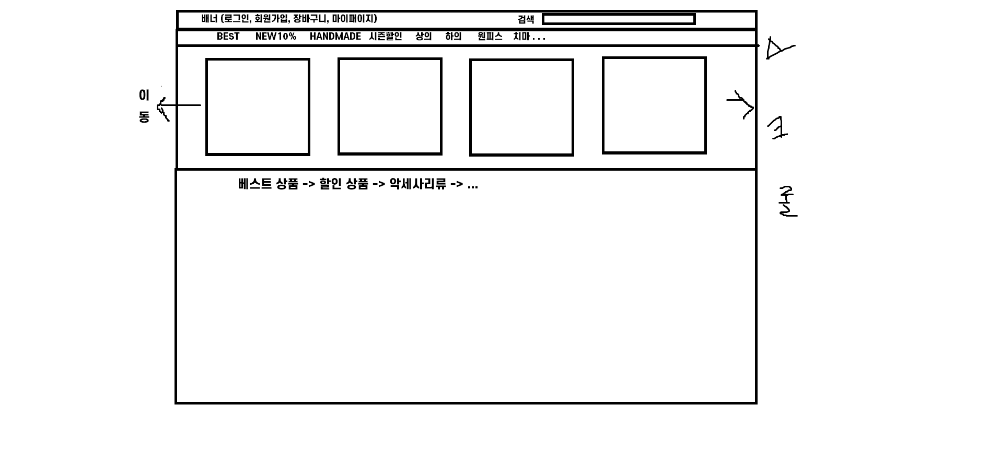

# JPA_practice_small

~~for 쿼리 동작하기, 서버에 table 등록 성공시키기!!~~

위에 것을 이미 완료했으므로, 연습 겸 
<em>"쇼핑몰 클론코딩"<em>을 실시해보고자 함!

1. 일단 어떤 항목이 필요한지 메인 홈페이지 구상
2. html 코드를 짜봄
   (이거 메인 페이지임 일단!)
3. 멤버 CRUD 관련 코드(리포지토리, 서비스, 객체)
 
회원 가입, 회원별 -> 상품 주문, 주문 조회, 즐겨찾기.. 

4. 페이지에 띄우기 위한 컨트롤러 및 html
   (여기서부터는 다중 상품 한번에 받는 issue 해결한 후에!)
5. 나머지 기능 구현 start!

 
ex. 항목들 옆으로 넘기기, 위에 배너 스크롤 내려도 고정

 

 

※ 나중에 그림 수정!! 배너 아래에 쇼핑몰 이름 적어놔야함