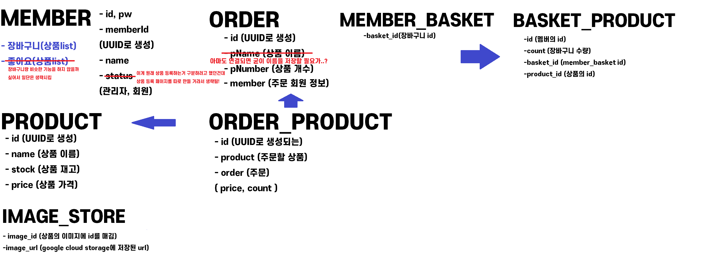
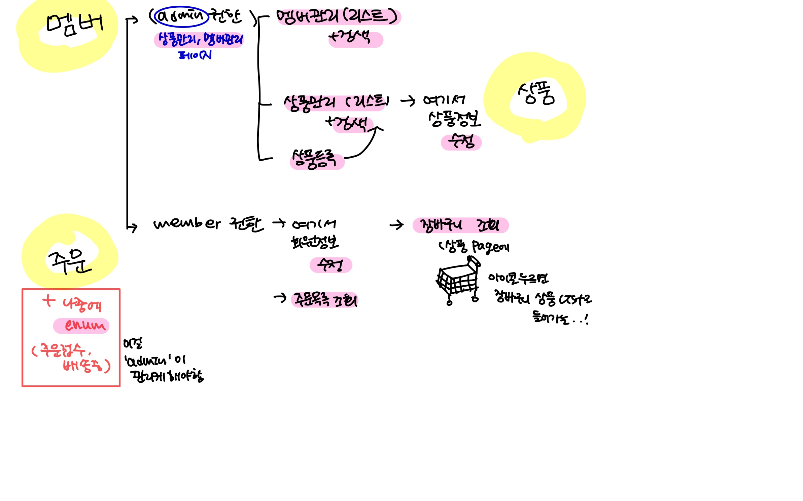
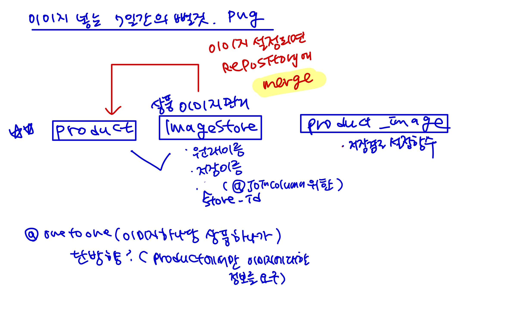

# CUTIEPIE Page ! ! !


#### 배포할 때 제발 내 바뀐 IP 주소 등록하고 시작하기... 


<em>"쇼핑몰 클론코딩"<em>을 실시해보고자 함!

1. 일단 어떤 항목이 필요한지 메인 홈페이지 구상
2. html 코드를 짜봄
   (이거 메인 페이지임 일단!)
3. 멤버 CRUD 관련 코드(리포지토리, 서비스, 객체)
회원 가입, 회원별 -> 상품 주문, 주문 조회, 즐겨찾기.. 
<br>

4. 페이지에 띄우기 위한 컨트롤러 및 html
   (여기서부터는 다중 상품 한번에 받는 issue 해결한 후에!)
5. 나머지 기능 구현 start!

<br>
ex. 항목들 옆으로 넘기기, 위에 배너 스크롤 내려도 고정

<br>


<br>


대충 컴포넌트들의 관계 정리를 위해, 추가할 것 포함 적어보았다
- 앞으로 멤버에 하트를 눌러놓은 좋아요 목록과, 
구매 계획이 있는 상품을 담아놓은 장바구니 목록을 생성할 것이다!!
- order, product 간의 다대다 관계 매핑을 막는 중간 매개체
  order_product를 잘 활용하여 변수들의 번거로운 재활용을
  막을 생각이다..

<br>




<br>
<br>

#### 개발해야 할 기능들 (v1)




<br>


#### 힘들었던 문제들

1)



:boom: 이게 너무 힘들었다 

```java
        em.merge(product)
```
이 코드 한 줄만 수정했으면 끝날 일이었다...  
<br>
물론 새로운 상품을 등록할 때는 merge함수가 좋지 않지만 여기서는
imageStore의 내용을 옮기기 위해 미리 생성해놓은 product 빈 생성자에 내용을 set시켜놓고
join함수를 사용하려다가 발생한 문제이므로....

그 죽일놈의 
```java
A different object with the same identifier value was already associated with the session
```
오류 때문에........
<br>
이 친구는 블로그에도 한번 정리할 계획이다.. 다양한 오류들을 많이 만나서..

<br>
<br>

2. 다양한 매핑 관계들
   :boom: 일대일 단방향 매핑 관계
```java
@OneToOne(fetch=FetchType.LAZY, cascade = CascadeType.MERGE)
@JoinColumn(name="image_id")
```
단방향이기 때문에 굳이 mappedBy를 써주지는 않았다.
<br>
다만 joincolumn에 사용되는 컬럼이 되도록이면 primary key를 사용하는 것 같다.


<br>

3. 이미지 form에서 입력받고 google cloud storage에 저장하여 url 남기기
<br>

왜 로컬에다 저장을 해야만 사진을 넘길 수 있냐고!!!!!!!!! 아직도 의문!!!!!